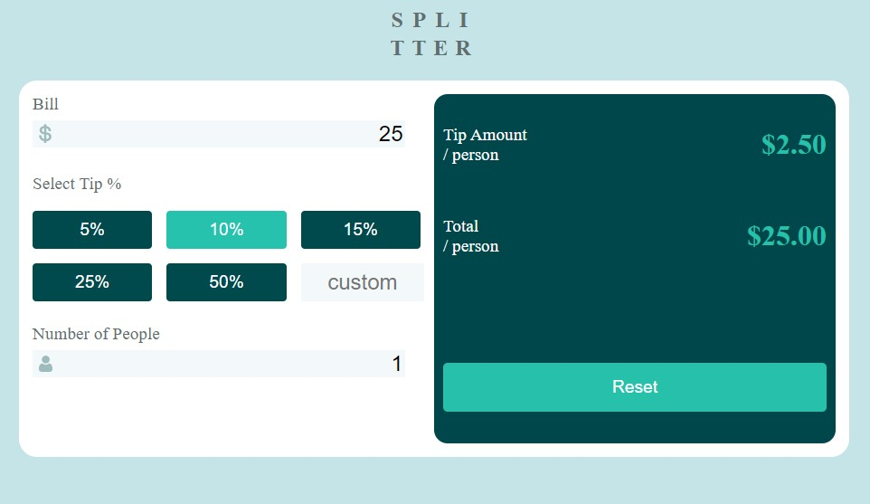

# Tip calculator app

Live verzia [Tip calculator app](https://lctipscalculator.netlify.app/)

Ďalšie projekty: [GitHub](https://github.com/ladislav987?tab=stars)

---

## Popis funkcii:

### **function checkInput()**

- kontroluje či je vyplenený input

### **function formatUSD(numbers)**

- funkcia upraví výsledok do USD formátu

### **function count(percent, amount, people)**

- vypočíta výslednu sumu pre sprepitného na človeka a sumu na zaplatenie pre jedného

### **function resetHandler()**

- resetuje vstupy kalkulačky

### **function addClass(id)**

- nastavuje tlačidlám selected class
